# 教师端使用说明

陈涛 16302010026 复旦大学16级软件工程 

---

### 教师端网址：http://47.102.201.65:18080/

---

### 登录、注册

+ 登录界面，输入账户密码即可登录，点击注册，可以到注册界面
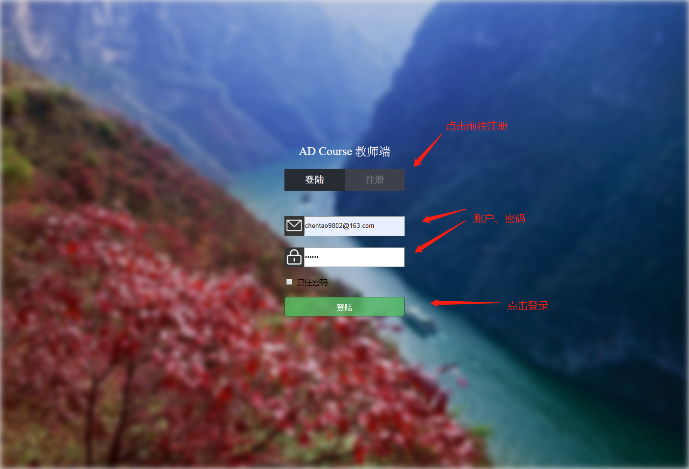
+ 注册界面，输入用户名、密码之后即可注册，注册成功会回到登录界面
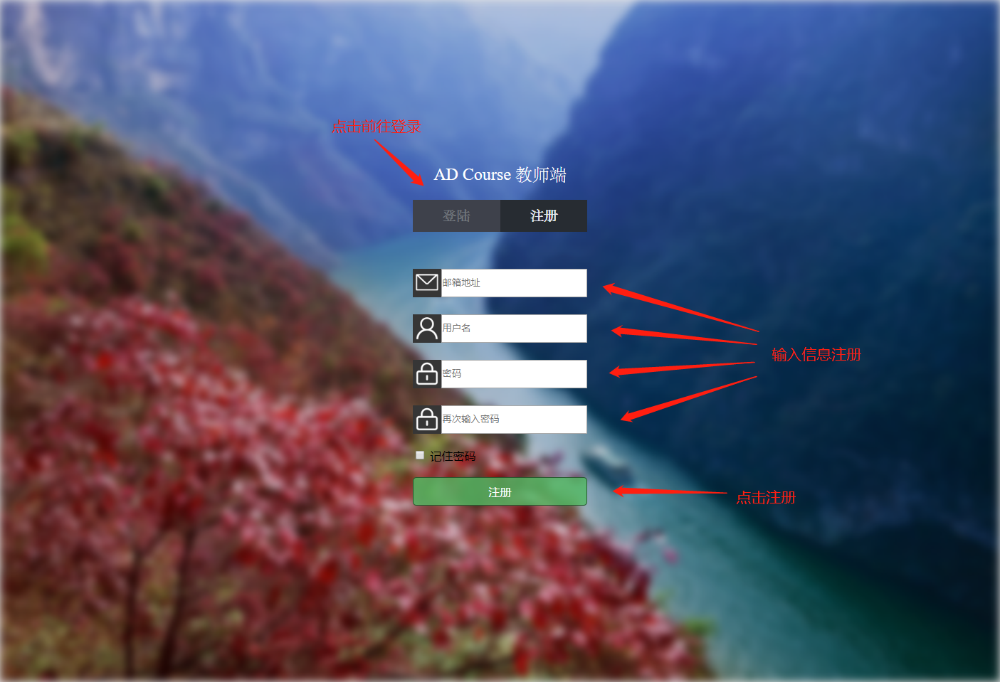

---

### 我的课程

+ 登录之后自动跳转到我的课程界面，会显示教师的所有课程
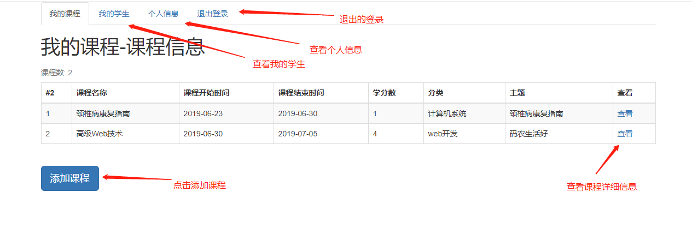
+ 在我的课程界面可以添加课程
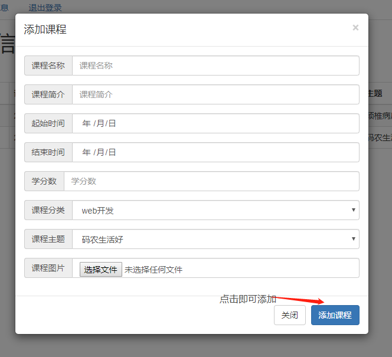
+ 课程详细信息
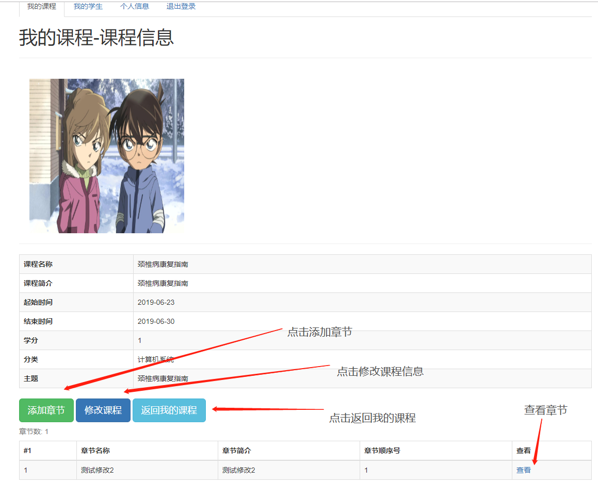
+ 在我的课程界面可以修改课程
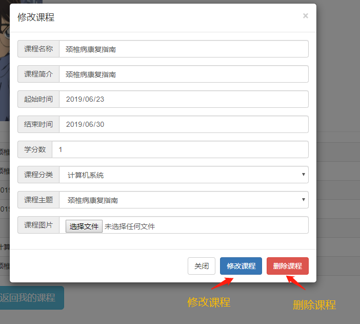
+ 在我的课程界面可以添加章节
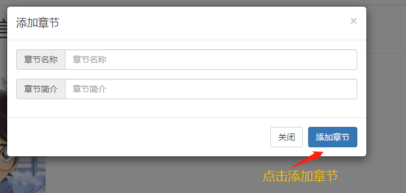
+ 章节详细信息
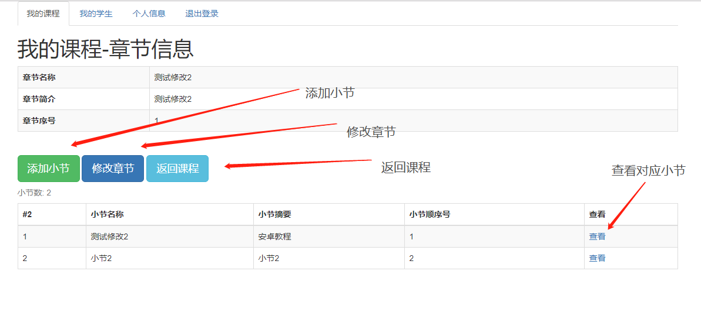
+ 在章节详细信息界面可以修改章节
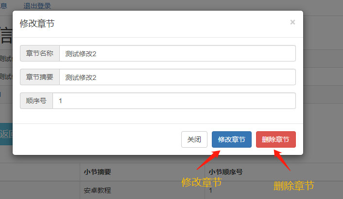
+ 在章节详细信息界面可以添加小节
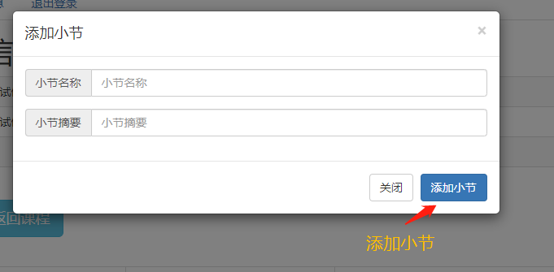
+ 小节详细信息
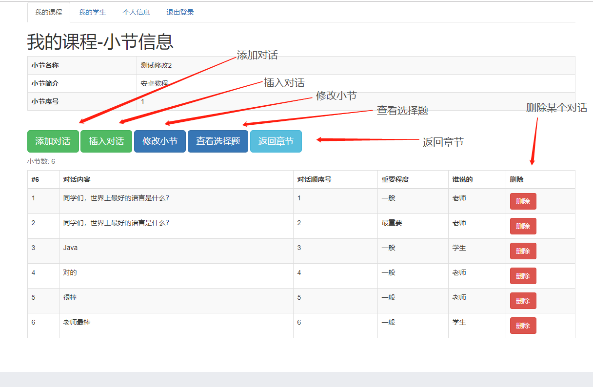
+ 在小节详细信息界面可以修改小节
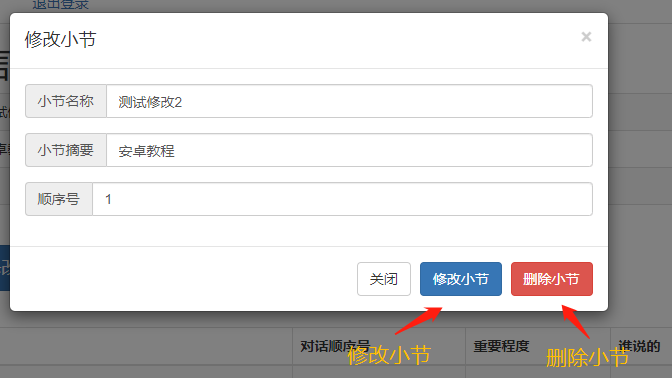
+ 在小节详细信息界面可以添加对话
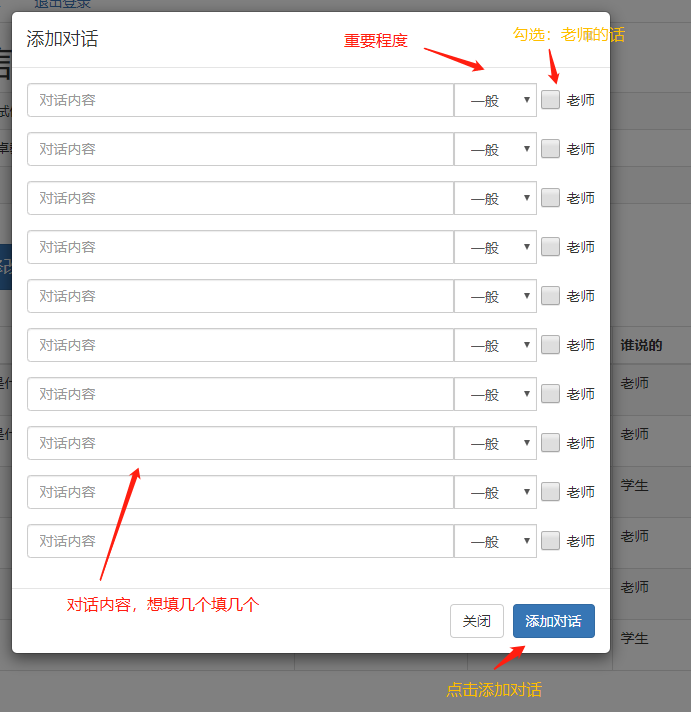
+ 在小节详细信息界面在任意顺序可以插入对话

+ 选择题详细信息
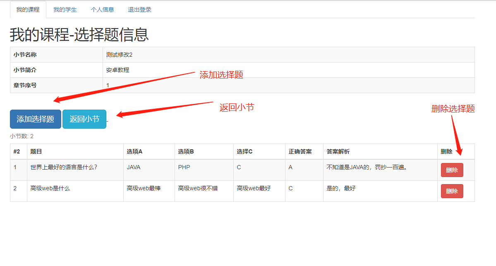
+ 在选择题详细信息界面可以添加选择题
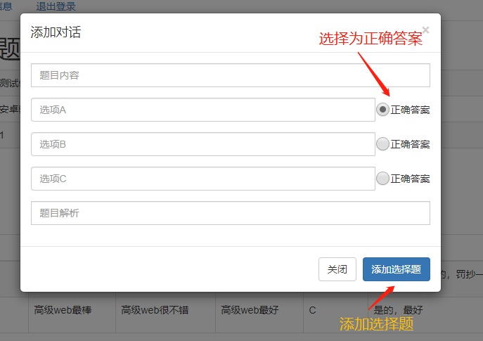

---

### 查看学生选课、作业情况

+ 查看我的课程，选择课程查看该课程学生
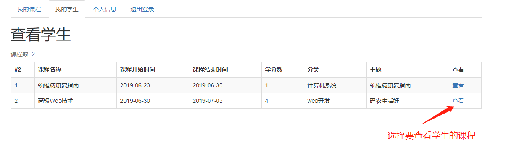
+ 查看某个课程的选课学生以及学习情况
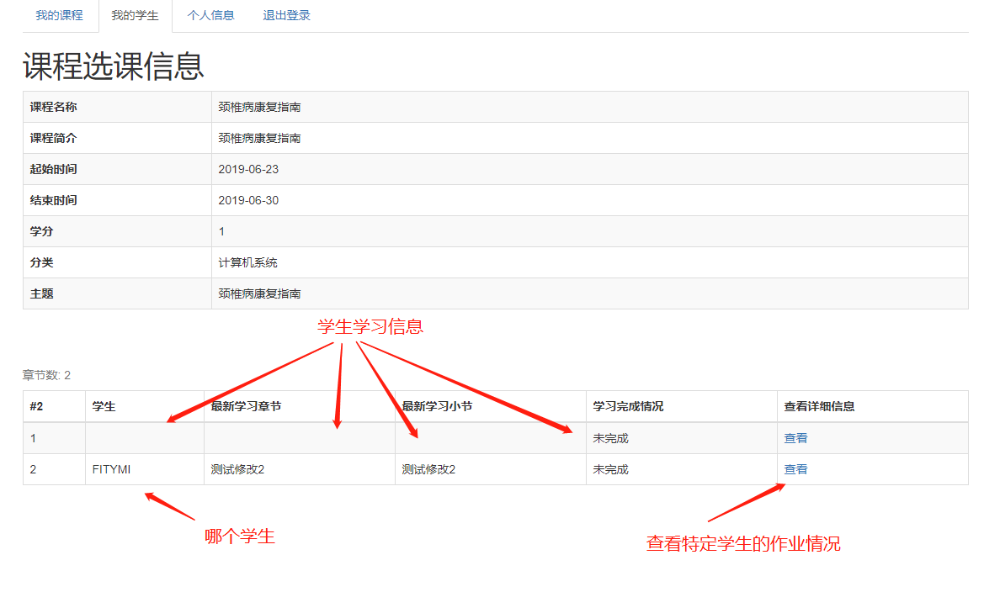
+ 查看某个学生的作业情况
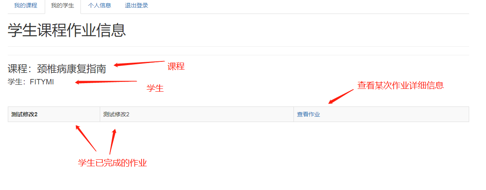
+ 查看某个学生的某个作业的答题情况
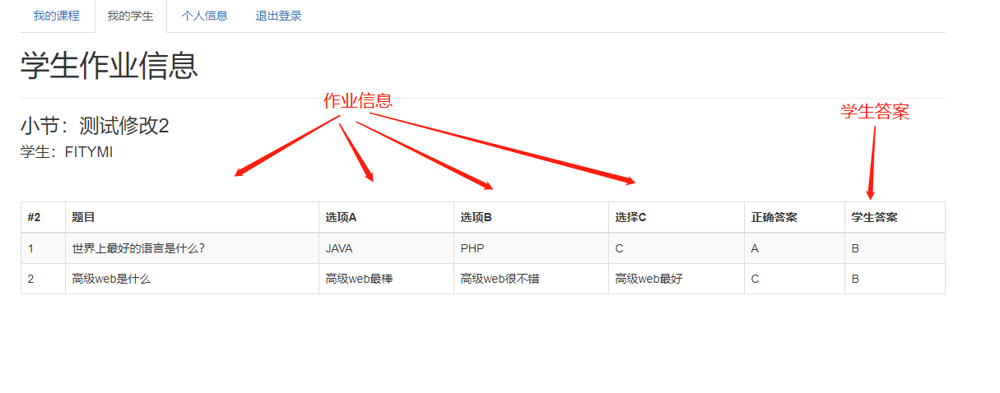

---

### 个人信息界面

+ 查看个人信息
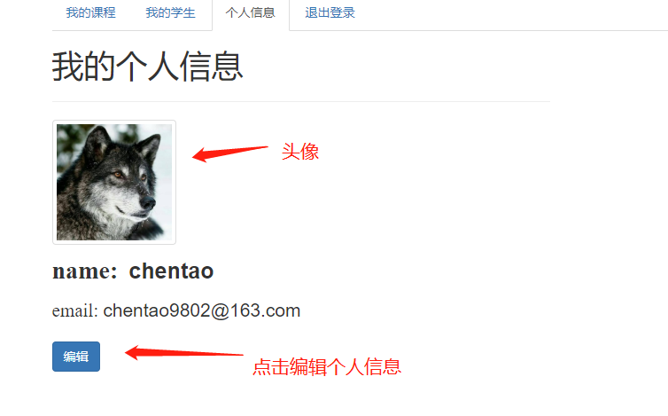
+ 修改个人信息
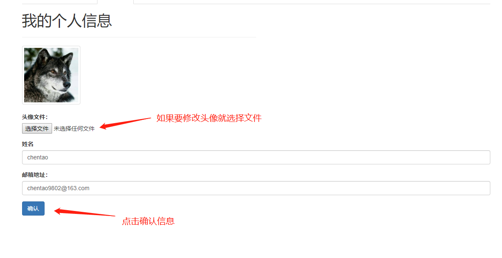